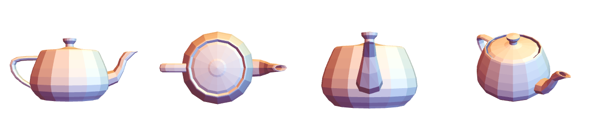
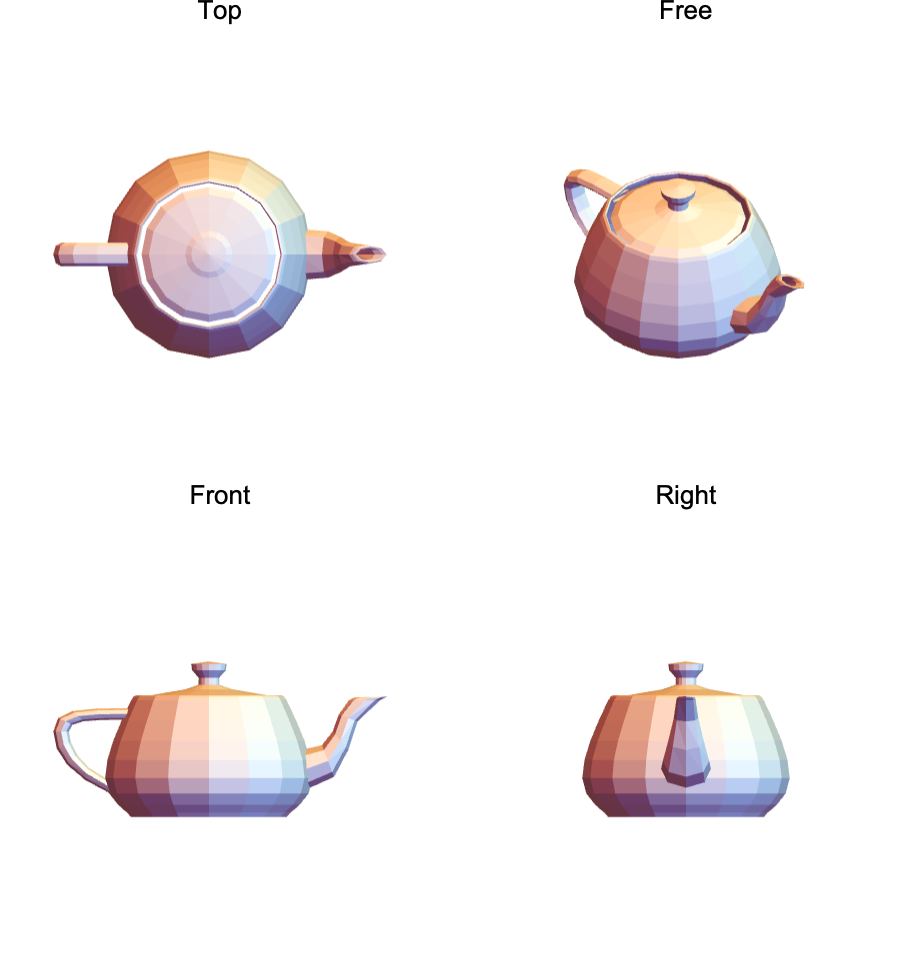
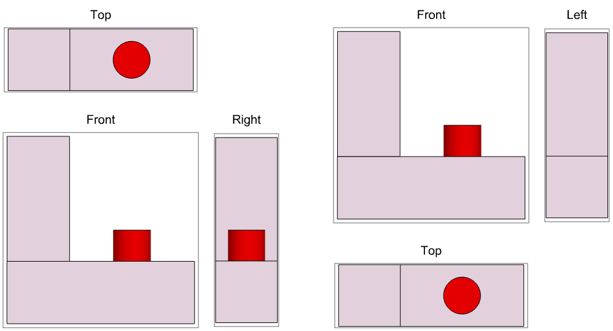
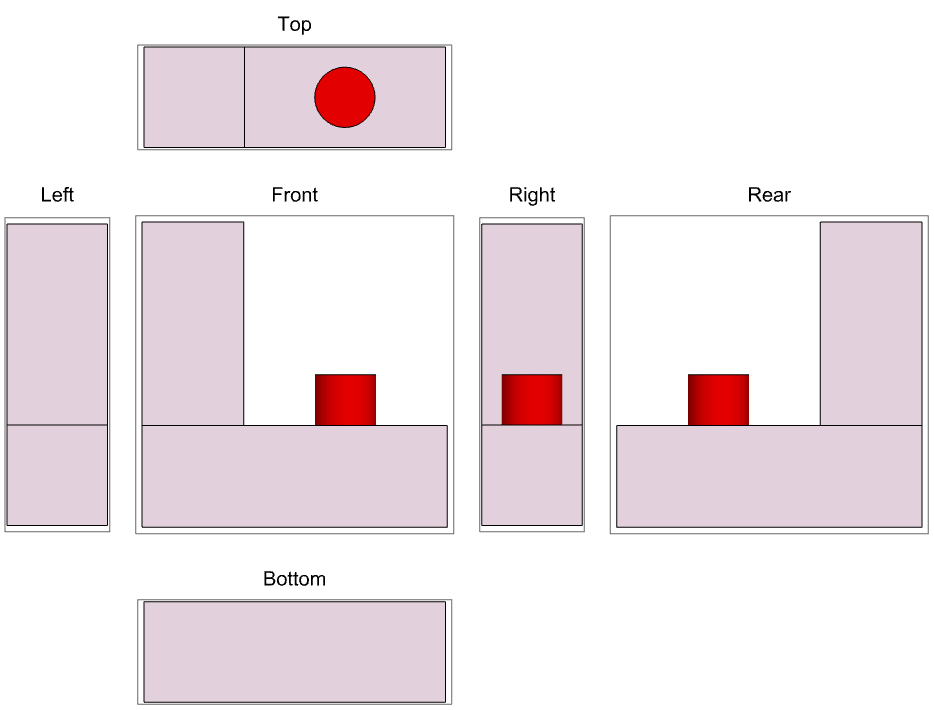
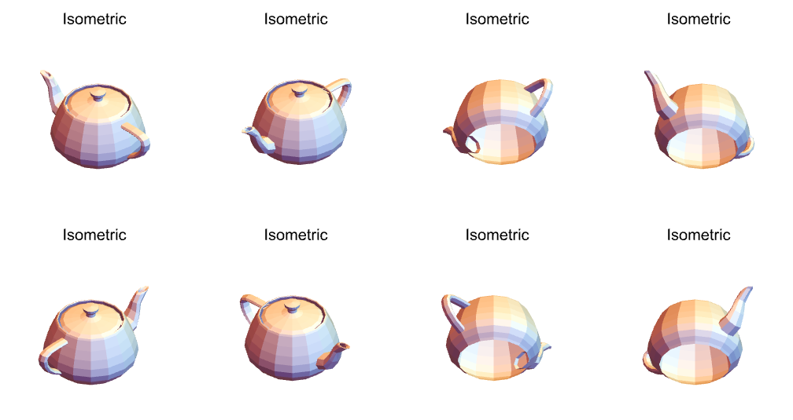
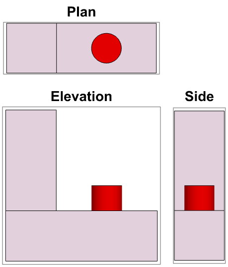
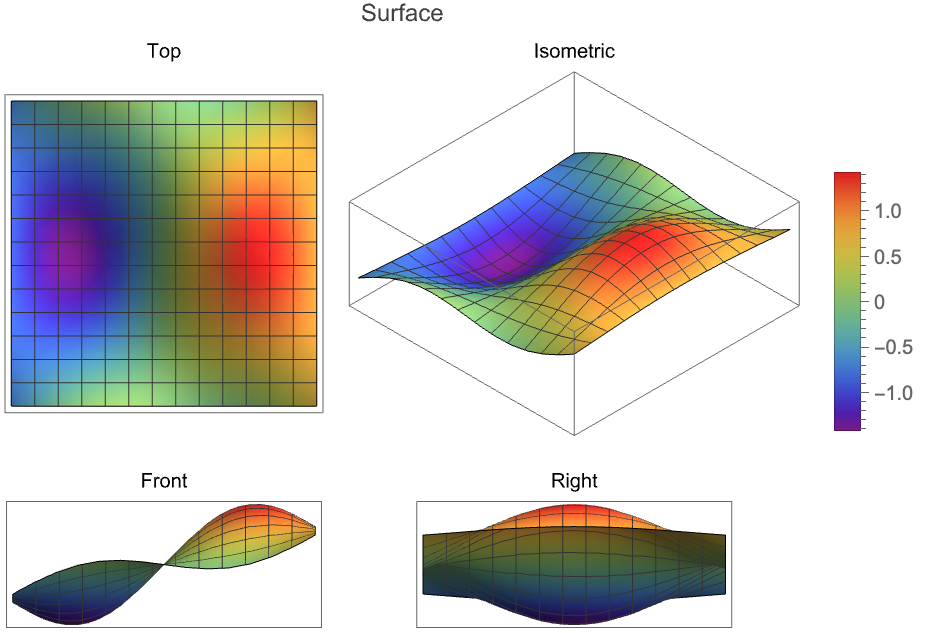

# MultiviewGraphics3D

`MultiviewGraphics3D[g]` shows a 3D graphic from several standard views at once: top, front, side, isometric, or any
layout you give it. All views share one scale, one orientation convention and one lighting setup. The function is
written for submission to the [Wolfram Function Repository](https://resources.wolframcloud.com/FunctionRepository/).

## Motivation

The obvious approach looks easy:

```wl
GraphicsRow[Show[g, ViewPoint -> #] & /@ {Front, Above, Right, {1, -1, 1}}]
```



It fails in predictable ways:

- **Scale drift.** Each pane fits its own region, so the object is a different size in each view. The side view
  above shows the teapot's body larger than the front view does.
- **Perspective.** The views are perspective projections unless you know to set `ViewProjection -> "Orthographic"`.
- **Orientation.** For a set of views to fit together, each view needs its own `ViewVertical`.
- **Lighting.** Default lighting follows the camera, so each view lights the object differently.
- **Conventions.** Where each view goes depends on whether the drawing uses first-angle or third-angle projection.

`MultiviewGraphics3D` handles all of these. Its output is interactive by default: panning, zooming and rotating one
pane updates the others.

## Installation

Until the function is published in the Function Repository, load the package file:

```wl
Get["path/to/MultiviewGraphics3D.wl"]
```

## Examples

The examples use these two objects:

```wl
teapot = ExampleData[{"Geometry3D", "UtahTeapot"}];
lblock = Graphics3D[{Cuboid[{0, 0, 0}, {3, 1, 1}], Cuboid[{0, 0, 1}, {1, 1, 3}],
    Red, Cylinder[{{2, 0.5, 1}, {2, 0.5, 1.5}}, 0.3]}];
```

### Quad view (the default)

Top, front and right orthographic views, plus a free view. By default the output is axis-locked: panning or zooming
one pane does the same in the others, and you can rotate the free pane. With `"CameraInteraction" -> "RigLocked"`,
rotating any pane rotates all of them together.

```wl
MultiviewGraphics3D[teapot]
```



### Third-angle and first-angle projection

`"CameraInteraction" -> None` gives a static figure for print. `"ProjectionConvention"` switches between the
third-angle (US) and first-angle (ISO) arrangements.

```wl
Row[{
  MultiviewGraphics3D[lblock, "ThreeView", "CameraInteraction" -> None],
  Spacer[40],
  MultiviewGraphics3D[lblock, "ThreeView", "CameraInteraction" -> None,
   "ProjectionConvention" -> "FirstAngle"]}]
```



### Unfolded glass box

```wl
MultiviewGraphics3D[lblock, "Net", "CameraInteraction" -> None]
```



### Isometric corners

`"Isometric"` shows the four upper corners; `{"Isometric", All}` shows all eight.

```wl
MultiviewGraphics3D[teapot, {"Isometric", All}, "CameraInteraction" -> None, ImageSize -> 500]
```



### View labels

```wl
MultiviewGraphics3D[lblock, "ThreeView", "CameraInteraction" -> None,
 "ViewLabels" -> <|Above -> "Plan", Front -> "Elevation", Right -> "Side"|>,
 LabelStyle -> Directive[Bold, 14]]
```



### Legends and plot labels

A legend or `PlotLabel` on the input appears once, for the whole figure.

```wl
MultiviewGraphics3D[
 Plot3D[Sin[x] Cos[y] + x/4, {x, -3, 3}, {y, -2, 2}, Mesh -> 12, ColorFunction -> "Rainbow",
  PlotLegends -> Automatic, PlotLabel -> "Surface", Axes -> False],
 "CameraInteraction" -> None]
```



### More

```wl
(* Your own layout: named views, a direction vector and a perspective free pane *)
MultiviewGraphics3D[teapot, {{Front, {1, -2, 1}}, {Above, "Free"}},
 ViewPoint -> {-2, -1, 1}, ViewProjection -> "Perspective"]

(* Regions and molecules also work as input *)
MultiviewGraphics3D[Ball[], "ThreeView"]
MultiviewGraphics3D[Molecule["caffeine"], "ThreeView"]

(* In Manipulate, the camera stays where you left it when a control changes *)
Manipulate[
 MultiviewGraphics3D[Plot3D[Sin[a x] Cos[y], {x, -3, 3}, {y, -3, 3}, Mesh -> None]],
 {a, 0.5, 3}]

(* For print, export the static figure *)
Export["lblock.pdf", MultiviewGraphics3D[lblock, "ThreeView", "CameraInteraction" -> None]]
```

## Options

| Option | Values | Default |
|---|---|---|
| `"CameraInteraction"` | `"AxisLocked"`, `"RigLocked"`, `None` (static) | `"AxisLocked"` |
| `"ProjectionConvention"` | `"ThirdAngle"`, `"FirstAngle"` | `"ThirdAngle"` |
| `"LightingAttachment"` | `Automatic`, `"Camera"`, `"Rig"`, `"Object"` | `Automatic` |
| `"ViewLabels"` | `Automatic`, `None`, an association from pane spec to label, a function | `Automatic` |
| `LabelStyle` | style for the view labels | `{}` |
| `PreserveImageOptions` | keep the camera when a surrounding `Dynamic` rebuilds the output | `True` |
| `ViewPoint`, `ViewProjection` | start and projection of the free pane | `{1, -1, 1}`, `"Orthographic"` |
| `ImageSize` | size of the whole figure | `Automatic` |

The layouts are `"QuadView"`, `"ThreeView"`, `"Net"`, `"Isometric"`, `{"Isometric", Above | Below | All}`, or a
rectangular matrix of pane specs. A pane spec is `Above`, `Below`, `Front`, `Back`, `Left`, `Right`, a direction
vector, `"Free"` (at most one) or `None` (an empty cell).

## Limitations

- The function has not been tested in the Wolfram Cloud. It may work there, but use it at your own risk.
- Copy Graphic on interactive output copies the default view, not the view you have explored.

## Tests

```sh
wolframscript -file Tests/run.wls
```
